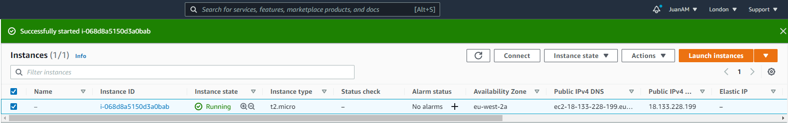

# PROJECT 1 - WEB STACK IMPLEMENTATION (LAMP STACK) IN AWS

## Step 0 - Preparing prerequisites

* Launch EC2 instance 


 * Change premissions for the private key file (.pem), otherwise you can get an error “Bad permissions”
 ```
 sudo chmod 0400 <private-key-name>.pem
 ```
 * Connect to the instance by running:
````
ssh -i <private-key-name>.pem ubuntu@<Public-IP-address>
````


## Step 1 — Installing Apache and Updating the Firewall
The Apache web server is among the most popular web servers in the world. It’s well documented, has an active community of users, and has been in wide use for much of the history of the web, which makes it a great default choice for hosting a website.

* Install Apache using Ubuntu’s package manager ‘apt’:
```
#update a list of packages in package manager
$ sudo apt update
```


```
#run apache2 package installation
$ sudo apt install apache2
```


* To verify that apache2 is running as a Service in our OS, use following command:
```
$ sudo systemctl status apache2
```


* Open inbound port 80


Our server is running and we can access it locally and from the Internet (Source 0.0.0.0/0 means ‘from any IP address’).

* First, let us try to check how we can access it locally in our Ubuntu shell, run:
```
$ curl http://localhost:80
or
$ curl http://127.0.0.1:80
```


* Now it is time for us to test how our Apache HTTP server can respond to requests from the Internet. Open a web browser of your choice and try to access following url:
```
http://<Public-IP-Address>:80
```


* Another way to retrieve your Public IP address, other than to check it in AWS Web console, is to use following command:
```
curl -s http://169.254.169.254/latest/meta-data/public-ipv4
```


* If you see following page, then your web server is now correctly installed and accessible through your firewall.


## Step 2 — Installing MySQL
Now that you have a web server up and running, you need to install a Database Management System (DBMS) to be able to store and manage data for your site in a relational database. MySQL is a popular relational database management system used within PHP environments, so we will use it in our project.
* Again, use ‘apt’ to acquire and install this software:
```
$ sudo apt install mysql-server
```


* When the installation is finished, it’s recommended that you run a security script that comes pre-installed with MySQL. This script will remove some insecure default settings and lock down access to your database system. Start the interactive script by running:
```
$ sudo mysql_secure_installation
```
* This will ask if you want to configure the VALIDATE PASSWORD PLUGIN. Answer Y for yes, or anything else to continue without enabling.


* If you answer “yes”, you’ll be asked to select a level of password validation. Keep in mind that if you enter 2 for the strongest level, you will receive errors when attempting to set any password which does not contain numbers, upper and lowercase letters, and special characters, or which is based on common dictionary words.


* If you enabled password validation, you’ll be shown the password strength for the root password you just entered and your server will ask if you want to continue with that password. If you are happy with your current password, enter Y for “yes” at the prompt:


* For the rest of the questions, press Y and hit the ENTER key at each prompt. This will remove some anonymous users and the test database, disable remote root logins, and load these new rules so that MySQL immediately respects the changes you have made.


* When you’re finished, test if you’re able to log in to the MySQL console by typing:
```
$ sudo mysql
```
This will connect to the MySQL server as the administrative database user root, which is inferred by the use of sudo when running this command. You should see output like this:


* To exit the MySQL console, type:
```
mysql> exit
```


Your MySQL server is now installed and secured. Next, we will install PHP, the final component in the LAMP stack.

## Step 3 — Installing PHP

In addition to the php package, you’ll need php-mysql, a PHP module that allows PHP to communicate with MySQL-based databases. You’ll also need libapache2-mod-php to enable Apache to handle PHP files. Core PHP packages will automatically be installed as dependencies.

* To install these 3 packages at once, run:
```
$ sudo apt install php libapache2-mod-php php-mysql
```


* Once the installation is finished, you can run the following command to confirm your PHP version:
```
php -v
```


At this point, your LAMP stack is completely installed and fully operational.
* Linux (Ubuntu)
* Apache HTTP Server
* MySQL
* PHP

We will configure our first Virtual Host in the next step.

## Step 4 — Creating a Virtual Host for your Website using Apache
In this project, you will set up a domain called projectlamp, but you can replace this with any domain of your choice. 

* Create the directory for projectlamp using ‘mkdir’ command as follows:
```
$ sudo mkdir /var/www/projectlamp
```
* Next, assign ownership of the directory with the $USER environment variable, which will reference your current system user:
```
$ sudo chown -R $USER:$USER /var/www/projectlamp
```
* Then, create and open a new configuration file in Apache’s sites-available directory using your preferred command-line editor. Here, we’ll be using vi or vim (They are the same by the way):
```
$ sudo vi /etc/apache2/sites-available/projectlamp.conf
```


* This will create a new blank file. Paste in the following bare-bones configuration by hitting on i on the keyboard to enter the insert mode, and paste the text:
```
<VirtualHost *:80>
    ServerName projectlamp
    ServerAlias www.projectlamp 
    ServerAdmin webmaster@localhost
    DocumentRoot /var/www/projectlamp
    ErrorLog ${APACHE_LOG_DIR}/error.log
    CustomLog ${APACHE_LOG_DIR}/access.log combined
</VirtualHost>
```


* To save and close the file, simply follow the steps below:
1. Hit the esc button on the keyboard
1. Type :
1. Type wq. w for write and q for quit
1. Hit ENTER to save the file

* You can use the ls command to show the new file in the sites-available directory:
```
$ sudo ls /etc/apache2/sites-available
```
You will see something like this:
```
000-default.conf  default-ssl.conf  projectlamp.conf
```


* You can now use a2ensite command to enable the new virtual host:
```
$ sudo a2ensite projectlamp
```


You might want to disable the default website that comes installed with Apache. This is required if you’re not using a custom domain name, because in this case Apache’s default configuration would overwrite your virtual host. 
* To disable Apache’s default website use a2dissite command , type:
```
$ sudo a2dissite 000-default
```
* To make sure your configuration file doesn’t contain syntax errors, run:
```
$ sudo apache2ctl configtest
```
* Finally, reload Apache so these changes take effect:
```
$ sudo systemctl reload apache2
```


Your new website is now active, but the web root /var/www/projectlamp is still empty.
* Create an index.html file in that location so that we can test that the virtual host works as expected:
```
sudo echo 'Hello LAMP from hostname' $(curl -s http://169.254.169.254/latest/meta-data/public-hostname) 'with public IP' $(curl -s http://169.254.169.254/latest/meta-data/public-ipv4) > /var/www/projectlamp/index.html
```


* Now go to your browser and try to open your website URL using IP address:
```
http://<Public-IP-Address>:80
```


* You can also access your website in your browser by public DNS name, not only by IP - try it out, the result must be the same (port is optional)
```
http://<Public-DNS-Name>:80
```


If you see the text from ‘echo’ command you wrote to index.html file, then it means your Apache virtual host is working as expected. In the output you will see your server’s public hostname (DNS name) and public IP address.


You can leave this file in place as a temporary landing page for your application until you set up an index.php file to replace it. Once you do that, remember to remove or rename the index.html file from your document root, as it would take precedence over an index.php file by default.

## Step 5 — Enable PHP on the website
With the default DirectoryIndex settings on Apache, a file named index.html will always take precedence over an index.php file. 
Because this page will take precedence over the index.php page, it will then become the landing page for the application.
* In case you want to change this behavior, you’ll need to edit the /etc/apache2/mods-enabled/dir.conf file and change the order in which the index.php file is listed within the DirectoryIndex directive:
```
sudo vim /etc/apache2/mods-enabled/dir.conf
```

```
<IfModule mod_dir.c>
        #Change this:
        #DirectoryIndex index.html index.cgi index.pl index.php index.xhtml index.htm
        #To this:
        DirectoryIndex index.php index.html index.cgi index.pl index.xhtml index.htm
</IfModule>
```


* After saving and closing the file, you will need to reload Apache so the changes take effect:
```
$ sudo systemctl reload apache2
```


Now that you have a custom location to host your website’s files and folders, we’ll create a PHP test script to confirm that Apache is able to handle and process requests for PHP files.
* Create a new file named index.php inside your custom web root folder:
```
$ vim /var/www/projectlamp/index.php
```
* This will open a blank file. Add the following text, which is valid PHP code, inside the file:
```
<?php
phpinfo();
```


* When you are finished, save and close the file, refresh the page and you will see a page similar to this:


If you can see this page in your browser, then your PHP installation is working as expected.
* After checking the relevant information about your PHP server through that page, it’s best to remove the file you created as it contains sensitive information about your PHP environment -and your Ubuntu server. You can use rm to do so:
```
$ sudo rm /var/www/projectlamp/index.php
```


Congratulations! You have finished your very first REAL LIFE PROJECT by deploying a LAMP stack website in AWS Cloud!