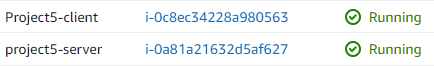
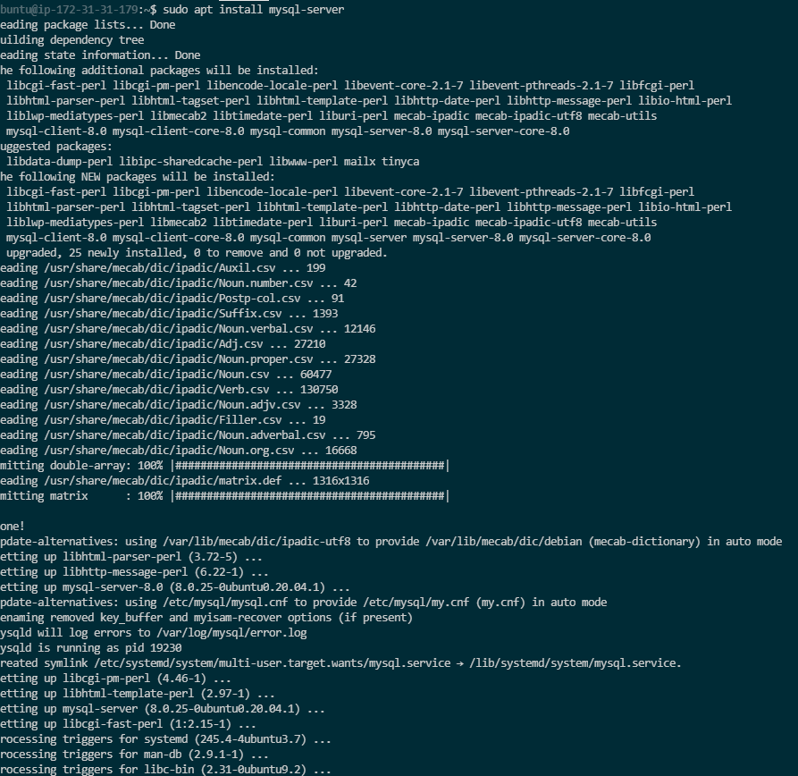
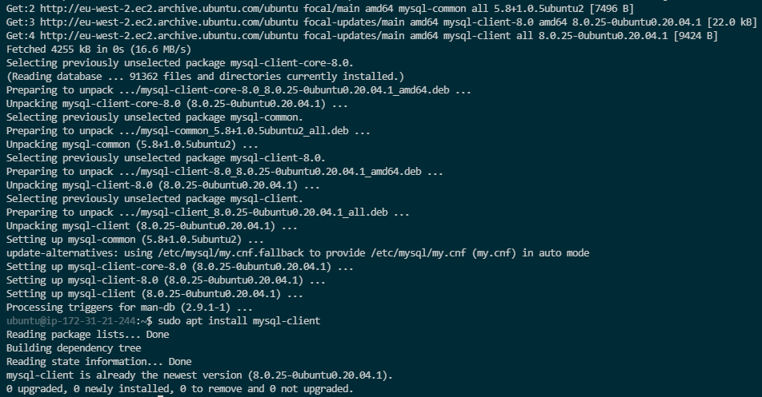
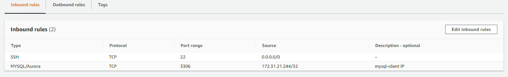
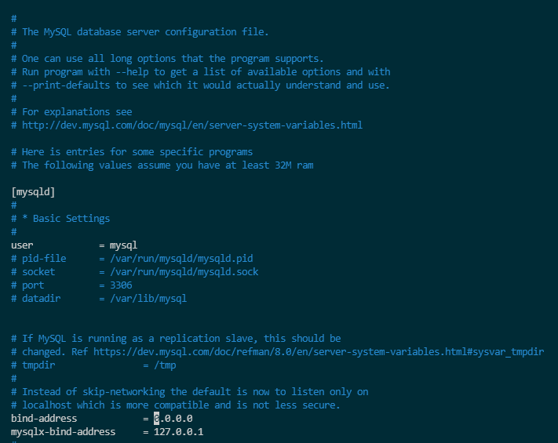
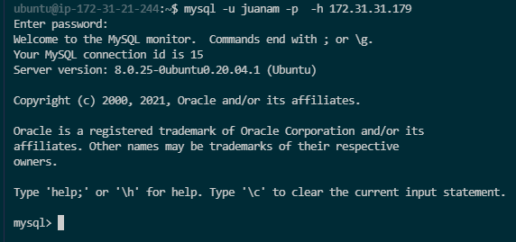

# PROJECT 5 - Implement a Client Server Architecture using MySQL Database Management System (DBMS)      
To demonstrate a basic client-server using MySQL RDBMS, follow the below instructions
* Create and configure two Linux-based virtual servers (EC2 instances in AWS).
```
Server A name - `mysql server`
Server B name - `mysql client`
```

* On `mysql server` Linux Server install MySQL Server software.
```
sudo apt install mysql-server
```


* On `mysql client` Linux Server install MySQL Client software.
```
sudo apt install mysql-client
```


Use `mysql server's` local IP address to connect from `mysql client`. MySQL server uses TCP port 3306 by default, so you will have to open it by creating a new entry in ‘Inbound rules’ in ‘mysql server’ Security Groups. 

* For extra security, do not allow all IP addresses to reach your ‘mysql server’ - allow access only to the specific local IP address of your ‘mysql client’.



* You might need to configure MySQL server to allow connections from remote hosts.
```
sudo vim /etc/mysql/mysql.conf.d/mysqld.cnf 
```
* Replace ‘127.0.0.1’ to ‘0.0.0.0’ like this:



From `mysql client` Linux Server connect remotely to `mysql server` Database Engine without using SSH. 

You must use the `mysql` utility to perform this action.
```
mysql -u username -p -h IP-address
```
If you see an output similar to the below image, then you have successfully completed this project - you have deployed a fully functional MySQL Client-Server set up.

