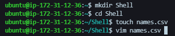
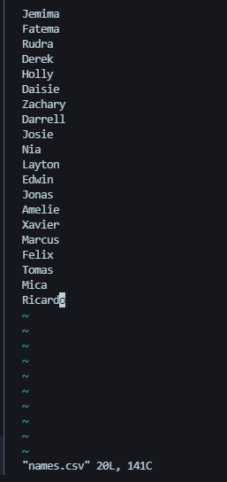
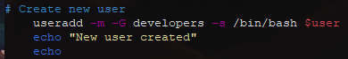
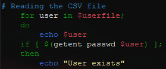
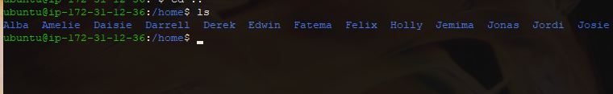
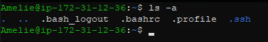
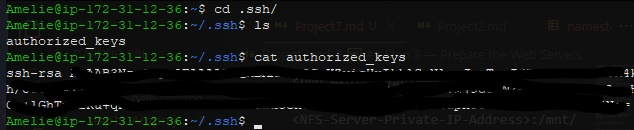

# Aux Project 1 -  Shell Scripting
In this project, you need to onboard 20 new Linux users onto a server. Create a shell script that reads a csv file that contains the first name of the users to be onboarded.
* Create the project folder called Shell
```
mkdir Shell
```
* Open the names.csv file
```
vim names.csv
```


* Insert some random names into it. (One name per line)



## Shell Script 
1. The script you created should read the CSV file, create each user on the server, and add to an existing group called developers (You will need to manually create this group ahead).



1. Ensure that your script will first check for the existence of the user on the system, before it will attempt to create it.



1. Ensure that the user that is being created also has a default home folder



1. Ensure that each user has a .ssh folder within its HOME folder. If it does not exist, then create it.



1. For each user’s SSH configuration, create an authorized_keys file and ensure it has the public key of your current user.


